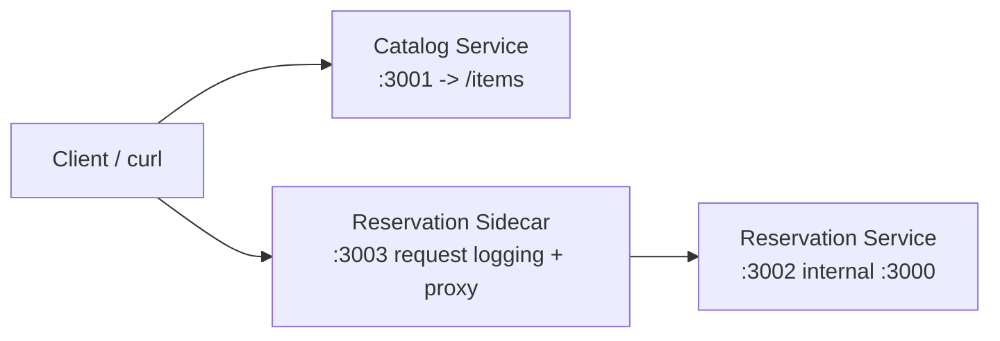

# Sprint 2 Services

## Service Overview

* **catalog-service (primary):** Simulates costume, prop, and set piece inventory lookup.
* **reservation-service (primary):** Simulates reservation reads and writes for lending requests.
* **reservation-sidecar (sidecar pattern):** Proxies all reservation traffic and logs each request with method, path, status code, and latency.

## Connection Diagram

## Endpoints (Simulation)

* **catalog-service**
	* `GET /health`
	* `GET /items` (includes synthetic latency via `setTimeout`)
	* `GET /items/:itemId`
* **reservation-service**
	* `GET /health`
	* `GET /reservations` (includes synthetic latency via `setTimeout`)
	* `POST /reservations` (includes synthetic latency via `setTimeout`)
* **reservation-sidecar**
	* `GET /health`
	* Forwards `/*` to `reservation-service` and logs each request
