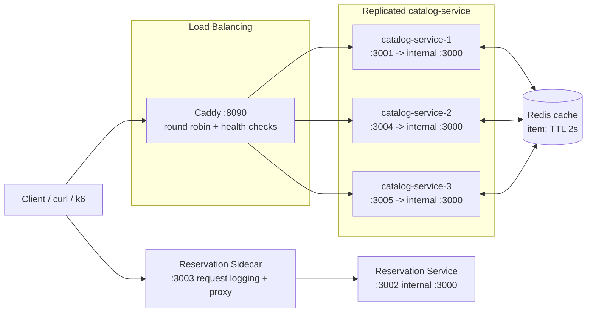

# Sprint 3 Services

## Service Overview

* **catalog-service (primary, replicated):** Simulates costume, prop, and set piece inventory lookup. Runs as three replicas (`catalog-service-1/2/3`) behind Caddy's load balancer; item lookups are cached in Redis.
* **caddy (load balancer):** Distributes `/items*` traffic across the three catalog-service replicas using round-robin with active health checks, so a stopped replica is automatically taken out of rotation.
* **redis (cache):** Shared cache for `GET /items/:itemId` results (2s TTL). All catalog-service replicas read/write the same cache, so a cache warmed by one replica is a hit for the others.
* **reservation-service (primary):** Simulates reservation reads and writes for lending requests.
* **reservation-sidecar (sidecar pattern):** Proxies all reservation traffic and logs each request with method, path, status code, and latency.

## Connection Diagram

## Endpoints (Simulation)

* **catalog-service** (identical code on all 3 replicas, `INSTANCE_ID` env var differs)
	* `GET /health`
	* `GET /items` (includes synthetic latency via `setTimeout`, no caching)
	* `GET /items/:itemId` (Redis-cached: cache hit returns immediately with `cache: "HIT"`; cache miss simulates a 250 ms backing-store fetch, stores the result in Redis with a 2s TTL, and returns `cache: "MISS"`). Every response also includes `instanceId` so replica distribution can be verified.
* **caddy**
	* Reverse proxies `:80` (mapped to host `:8090`) to `catalog-service-1/2/3:3000` using `lb_policy round_robin`, with active `/health` checks every 10s so a stopped replica is removed from rotation.
* **reservation-service**
	* `GET /health`
	* `GET /reservations` (includes synthetic latency via `setTimeout`)
	* `POST /reservations` (includes synthetic latency via `setTimeout`)
* **reservation-sidecar**
	* `GET /health`
	* Forwards `/*` to `reservation-service` and logs each request

